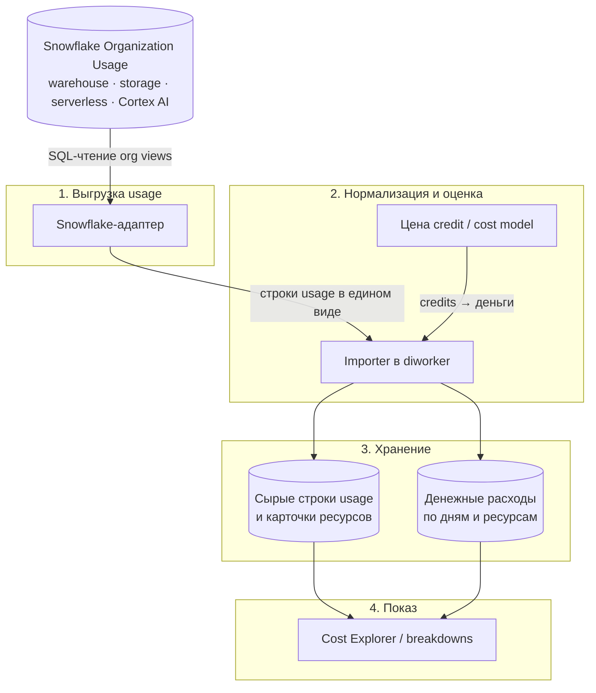
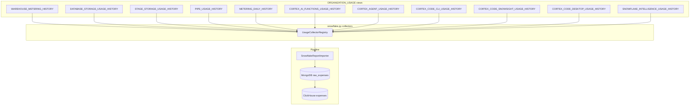

# Детальный план: Snowflake через `SNOWFLAKE.ORGANIZATION_USAGE` + Cortex AI

## Высокоуровневая интеграция с OptScale

Snowflake подключается как ещё один тип источника данных в существующий контур сбора биллинга OptScale (тот же, что для AWS, Azure, GCP и Databricks). Ниже — путь данных Snowflake внутри платформы: от выгрузки usage до отображения в отчётах.

### Точки соприкосновения с данными Snowflake



**1. Выгрузка usage.** Прямое обращение к Snowflake выполняется только в адаптере: по credentials organization account читаются организационные представления usage (compute, storage, serverless, Cortex). На выходе — поток строк потребления (credits, объёмы, аккаунт, warehouse / модель / функция и т.п.) без денежной оценки OptScale.

**2. Нормализация и оценка.** Importer приводит строки к общему формату расходов OptScale и переводит credits в деньги по cost model (контрактная цена credit и при необходимости overrides). На этом шаге Snowflake не вызывается.

**3. Хранение.** Данные сохраняются в двух слоях:
- сырые строки usage — для пересчёта cost при смене цены credit и детализации (модель Cortex, токены, warehouse);
- агрегированные денежные расходы по дням и ресурсам — для отчётов, в той же витрине, что у остальных облаков.

**4. Показ.** UI и API расходов читают сохранённые агрегаты и метаданные ресурсов, без обращений к Snowflake. В Cost Explorer источник выглядит как обычный data source с категориями Compute / Storage / Serverless / Cortex AI.

Оркестрация (API, очередь, планировщик) общая для всех источников: запускает импорт и хранит credentials / cost model; к данным Snowflake не обращается.

### Ключевые принципы

- Один подключённый источник = вся Snowflake Organization (не отдельный connector на каждый аккаунт внутри org).
- Источник истины по usage — организационные представления Snowflake (нужен organization account).
- В OptScale деньги считаются из credits и контрактной цены credit, а не как готовый счёт в валюте из Snowflake.
- Cortex AI — отдельная полноценная категория затрат рядом с compute и storage.
- Детальные AI- и warehouse-данные не дублируются агрегированными daily-строками того же потребления.

Ближайший аналог по реализации — интеграция Databricks.

---

## 1. Цель и scope

Добавить нативный data source `cloud_type = snowflake`, который подключается к **organization account** Snowflake и импортирует usage из `SNOWFLAKE.ORGANIZATION_USAGE` для:

- стандартных сервисов (warehouse compute, storage, serverless, data transfer и др.);
- **Cortex AI** (functions, agents, code, intelligence) как отдельная категория затрат с детализацией до function/model/agent.

**Не входит в MVP:** recommendations, discovery warehouses, BI export, marketplace billing через AWS/Azure.

---

## 2. Архитектурные решения

### 2.1. Модель подключения

| Параметр | Решение |
|----------|---------|
| Уровень доступа | Только **Organization account** (premium views) |
| Аутентификация | Key-pair service user + role `ORGADMIN` (или custom role с read на `SNOWFLAKE.ORGANIZATION_USAGE`) |
| `cloud_type` | `snowflake` — один тип на всю Snowflake Organization |
| Cost model | **Credit-based** + опциональные overrides по `service_type` / Cortex SKU |
| Import period | **6h** (latency premium views до 24h; `METERING_DAILY_HISTORY` — 2h) |
| Lookback | Первый импорт: 90 дней; далее: с `last_import_at - 2 days` (перекрытие для late-arriving data) |

### 2.2. Принцип «без двойного учёта»

Snowflake явно разделяет billing:

- `CORTEX_*_USAGE_HISTORY.CREDITS` — **не включает** warehouse credits;
- `WAREHOUSE_METERING_HISTORY.CREDITS_USED` — compute warehouse;
- `METERING_DAILY_HISTORY` с `SERVICE_TYPE = AI_SERVICES` — агрегат, **не дублировать** с детальными Cortex views.



**Reconciliation job** (фаза 4): сравнение суммы детальных views vs `METERING_DAILY_HISTORY.CREDITS_BILLED` по `(account, service_type, date)` — warning в import log, не блокирует импорт.

---

## 3. Маппинг Snowflake views → OptScale

### 3.1. Стандартные сервисы

| View | `service_category` | `service_type` | `resource_id` | Поле credits/cost |
|------|-------------------|----------------|---------------|---------------------|
| `WAREHOUSE_METERING_HISTORY` | `compute` | `WAREHOUSE_METERING` | `{account_locator}/{warehouse_id}` | `CREDITS_USED` |
| `DATABASE_STORAGE_USAGE_HISTORY` | `storage` | `DATABASE_STORAGE` | `{account_locator}/{database_id}` | bytes → credits через rate |
| `STAGE_STORAGE_USAGE_HISTORY` | `storage` | `STAGE_STORAGE` | `{account_locator}/{stage_id}` | bytes → credits |
| `PIPE_USAGE_HISTORY` | `serverless` | `PIPE` | `{account_locator}/{pipe_id}` | `CREDITS_USED` |
| `AUTOMATIC_CLUSTERING_HISTORY` | `serverless` | `AUTO_CLUSTERING` | `{account_locator}/{table_id}` | `CREDITS_USED` |
| `DATA_TRANSFER_HISTORY` | `transfer` | `DATA_TRANSFER` | `{account_locator}/{source_region}/{dest_region}` | `BYTES_TRANSFERRED` → cost |
| `METERING_DAILY_HISTORY`* | `serverless` | `<SERVICE_TYPE>` | `{account_locator}/{service_type}` | `CREDITS_BILLED` |

\* `METERING_DAILY_HISTORY` — только для service types **без** dedicated view: `SERVERLESS_TASK`, `MATERIALIZED_VIEW`, `SEARCH_OPTIMIZATION`, `QUERY_ACCELERATION`, `SNOWPARK_CONTAINER_SERVICES`, `REPLICATION` и т.д. **Исключить** `AI_SERVICES`, `CORTEX_*`, `WAREHOUSE_METERING` (есть dedicated views).

### 3.2. Cortex AI (обязательный scope)

По [документации Snowflake](https://docs.snowflake.com/en/user-guide/snowflake-cortex/governance-and-availability/ai-cost-management-and-governance) — **primary views для AI cost totals**:

| View | `service_type` | `resource_id` | Ключевые meta-поля |
|------|----------------|---------------|-------------------|
| `CORTEX_AI_FUNCTIONS_USAGE_HISTORY` | `AI_FUNCTIONS` | `{account}/{function_name}/{model_name}` | `QUERY_ID`, `USER_ID`, `ROLE_NAMES`, `METRICS` (tokens/pages), `WAREHOUSE_ID` |
| `CORTEX_AGENT_USAGE_HISTORY` | `CORTEX_AGENTS` | `{account}/{agent_id}` | `REQUEST_ID`, `TOKEN_CREDITS`, `CREDITS_GRANULAR`, `METADATA` |
| `CORTEX_CODE_CLI_USAGE_HISTORY` | `CORTEX_CODE_CLI` | `{account}/{user_id}` | tokens, tools |
| `CORTEX_CODE_SNOWSIGHT_USAGE_HISTORY` | `CORTEX_CODE_SNOWSIGHT` | `{account}/{user_id}` | tokens, tools |
| `CORTEX_CODE_DESKTOP_USAGE_HISTORY` | `CORTEX_CODE_DESKTOP` | `{account}/{user_id}` | tokens, tools |
| `SNOWFLAKE_INTELLIGENCE_USAGE_HISTORY` | `SNOWFLAKE_INTELLIGENCE` | `{account}/{resource_id}` | tokens, tools |

**UI breakdown для Cortex:**

```
Snowflake Total
├── Compute (Warehouses)
├── Storage
├── Serverless (Pipes, Tasks, ...)
├── Data Transfer
└── Cortex AI                    ← отдельный top-level filter
    ├── AI Functions (by model)
    ├── Agents
    ├── Cortex Code (CLI / Snowsight / Desktop)
    └── Snowflake Intelligence
```

**Total Cost of Operations** (фаза 5, optional): join Cortex rows с `QUERY_ID` → warehouse cost из `WAREHOUSE_METERING_HISTORY` для показа «AI inference + query compute».

---

## 4. Unified raw expense schema

Единая структура MongoDB `raw_expenses` для всех collectors:

```python
{
    # OptScale core
    "cloud_account_id": "uuid",
    "start_date": datetime,          # UTC
    "end_date": datetime,            # UTC
    "cost": float,                   # credits_used * credit_price
    "resource_id": str,

    # Snowflake dimensions
    "service_category": str,         # compute | storage | serverless | transfer | cortex_ai
    "service_type": str,             # WAREHOUSE_METERING | AI_FUNCTIONS | ...
    "organization_name": str,
    "account_locator": str,
    "account_name": str,
    "region": str,
    "resource_name": str,

    # Metering
    "credits_used": float,
    "credits_used_compute": float,   # optional
    "credits_used_cloud_services": float,

    # Cortex-specific (nullable)
    "function_name": str,
    "model_name": str,
    "query_id": str,
    "user_id": str,
    "role_names": list,
    "query_tag": str,
    "agent_id": str,
    "request_id": str,
    "tokens_input": int,
    "tokens_output": int,
    "tokens_total": int,
    "metrics": dict,                 # parsed from METRICS ARRAY
    "is_completed": bool,

    # Storage-specific
    "average_bytes": int,
}
```

### Unique keys (dedup) по `service_type`

| service_type | `get_unique_field_list()` |
|--------------|---------------------------|
| `WAREHOUSE_METERING` | `account_locator`, `warehouse_id`, `start_time`, `service_type` |
| `AI_FUNCTIONS` | `account_locator`, `query_id`, `function_name`, `model_name`, `start_time` |
| `CORTEX_AGENTS` | `account_locator`, `request_id`, `start_time` |
| `CORTEX_CODE_*` | `account_locator`, `user_id`, `start_time`, `service_type` |
| `DATABASE_STORAGE` | `account_locator`, `database_id`, `usage_date` |
| `METERING_DAILY` | `account_locator`, `service_type`, `usage_date` |

---

## 5. Cost model

### 5.1. Новый controller (рекомендуется)

Расширить `CostModelTypes` значением `CREDIT` или переиспользовать `SKU` с convention:

```python
# cloud_account.config.cost_model
{
    "credit_price": 2.50,                    # USD per credit (from contract)
    "storage_price_per_tb_month": 23.0,      # for byte-based storage views
    "service_type_overrides": {              # optional
        "AI_FUNCTIONS": 2.50,
        "CORTEX_AGENTS": 2.50
    },
    "cortex_model_overrides": {              # optional fine-grained
        "claude-4-sonnet": 3.00
    }
}
```

**Расчёт cost:**

```python
def calculate_cost(record, cost_model):
    if record.get('credits_used') is not None:
        price = (
            cost_model.get('cortex_model_overrides', {}).get(record.get('model_name'))
            or cost_model.get('service_type_overrides', {}).get(record['service_type'])
            or cost_model['credit_price']
        )
        return record['credits_used'] * price
    if record.get('average_bytes') is not None:
        tb = record['average_bytes'] / (1024**4)
        daily_rate = cost_model['storage_price_per_tb_month'] / 30
        return tb * daily_rate
    return 0
```

### 5.2. Файлы cost model

| Файл | Изменение |
|------|-----------|
| `rest_api/.../controllers/cost_model.py` | `SnowflakeCreditCostModelController` (или generalize `SkuBasedCostModelController`) |
| `rest_api/.../controllers/cloud_account.py` | `CloudTypes.SNOWFLAKE: SnowflakeCreditCostModelController` |
| `ngui/.../CostModel/` | UI: credit price + storage rate + discovered Cortex models |

---

## 6. Cloud Adapter — детальная реализация

**Файл:** `tools/cloud_adapter/clouds/snowflake.py`

### 6.1. Credentials

```python
BILLING_CREDS = [
    CloudParameter(name='account', type=str, required=True),       # org account identifier
    CloudParameter(name='user', type=str, required=True),
    CloudParameter(name='private_key', type=str, required=True, protected=True),
    CloudParameter(name='role', type=str, required=False, default='ORGADMIN'),
    CloudParameter(name='warehouse', type=str, required=True),     # for connection only
]
```

### 6.2. Collector registry

```python
class SnowflakeUsageCollector(ABC):
    VIEW_NAME: str
    SERVICE_CATEGORY: str
    TIME_COLUMN: str  # START_TIME | USAGE_DATE

    def fetch(self, conn, start_ts, end_ts) -> Iterator[dict]: ...

COLLECTORS = [
    WarehouseMeteringCollector,       # WAREHOUSE_METERING_HISTORY
    DatabaseStorageCollector,           # DATABASE_STORAGE_USAGE_HISTORY
    StageStorageCollector,              # STAGE_STORAGE_USAGE_HISTORY
    PipeUsageCollector,                 # PIPE_USAGE_HISTORY
    MeteringDailyCollector,             # METERING_DAILY_HISTORY (filtered)
    CortexAiFunctionsCollector,         # CORTEX_AI_FUNCTIONS_USAGE_HISTORY
    CortexAgentCollector,               # CORTEX_AGENT_USAGE_HISTORY
    CortexCodeCliCollector,             # CORTEX_CODE_CLI_USAGE_HISTORY
    CortexCodeSnowsightCollector,       # CORTEX_CODE_SNOWSIGHT_USAGE_HISTORY
    CortexCodeDesktopCollector,         # CORTEX_CODE_DESKTOP_USAGE_HISTORY
    SnowflakeIntelligenceCollector,     # SNOWFLAKE_INTELLIGENCE_USAGE_HISTORY
]
```

### 6.3. SQL-шаблоны (обязательно bounded time filter)

Пример warehouse:

```sql
SELECT
    organization_name, account_name, account_locator, region,
    warehouse_id, warehouse_name, service_type,
    start_time, end_time,
    credits_used, credits_used_compute, credits_used_cloud_services
FROM SNOWFLAKE.ORGANIZATION_USAGE.WAREHOUSE_METERING_HISTORY
WHERE start_time >= %(start_ts)s
  AND start_time < %(end_ts)s
ORDER BY start_time
```

Пример Cortex AI Functions:

```sql
SELECT
    organization_name, account_locator, account_name,
    start_time, end_time,
    function_name, model_name, query_id, warehouse_id,
    user_id, role_names, query_tag,
    metrics, credits, is_completed
FROM SNOWFLAKE.ORGANIZATION_USAGE.CORTEX_AI_FUNCTIONS_USAGE_HISTORY
WHERE start_time >= %(start_ts)s
  AND start_time < %(end_ts)s
```

### 6.4. Методы adapter

| Метод | Назначение |
|-------|------------|
| `validate_credentials()` | Connect + `SELECT 1 FROM ...WAREHOUSE_METERING_HISTORY LIMIT 1` + `...CORTEX_AI_FUNCTIONS_USAGE_HISTORY LIMIT 1` |
| `download_usage(start, end)` | Iterator по всем collectors, yield normalized dicts |
| `configure_report()` | No-op (нет S3 export), вернуть `{}` |
| `configure_last_import_modified_at()` | No-op |
| `discovery_calls_map()` | `{}` (фаза 6) |
| `get_regions_coordinates()` | `{}` |

### 6.5. Парсинг Cortex METRICS

```python
def parse_metrics(metrics_array) -> dict:
    result = {'tokens_input': 0, 'tokens_output': 0, 'tokens_total': 0, 'pages': 0}
    for item in metrics_array or []:
        metric = item['key']['metric']   # input | output | total | pages
        unit = item['key']['unit']
        value = item['value']
        if unit == 'tokens':
            if metric == 'input': result['tokens_input'] = value
            elif metric == 'output': result['tokens_output'] = value
            elif metric == 'total': result['tokens_total'] = value
        elif unit == 'pages':
            result['pages'] = value
    return result
```

### 6.6. Зависимости

```
tools/cloud_adapter/setup.py  → snowflake-connector-python[pandas]>=3.12
diworker/Dockerfile           → verify install
```

---

## 7. Report Importer — детальная реализация

**Файл:** `diworker/diworker/importers/snowflake.py`

### 7.1. Pipeline

```python
class SnowflakeReportImporter(BaseReportImporter):

    def load_raw_data(self):
        start = self.period_start
        end = opttime.utcnow()
        for batch in self.cloud_adapter.download_usage(start, end):
            self._enrich_record(batch)
            chunk.append(batch)
            if len(chunk) >= CHUNK_SIZE:
                self.update_raw_records(chunk)
                chunk = []

    def _enrich_record(self, record):
        record['cloud_account_id'] = self.cloud_acc_id
        record['cost'] = calculate_cost(record, self._cost_model)
        record['resource_id'] = self._build_resource_id(record)

    def generate_clean_records(self):
        # Aggregate to daily granularity per resource_id for ClickHouse
        # GROUP BY (cloud_account_id, resource_id, date, service_category)
```

### 7.2. ClickHouse mapping

| ClickHouse field | Snowflake source |
|------------------|------------------|
| `cloud_account_id` | OptScale UUID |
| `resource_id` | composite ID |
| `date` | `start_date` truncated to day |
| `cost` | calculated |
| `sign` | 1 |

**Meta в resources** (для UI breakdown): при `generate_clean_records` upsert в MongoDB `resources` с:

- `meta.service_category`
- `meta.service_type`
- `meta.account_name`
- `meta.model_name` (Cortex)
- `meta.function_name` (Cortex)

### 7.3. MongoDB indexes

**Файл:** `diworker/diworker/migrations/<rev>_snowflake_raw_expenses_indexes.py`

```python
# Compound indexes per service_type for upsert performance
[
    ('cloud_account_id', 'service_type', 'account_locator', 'warehouse_id', 'start_date'),
    ('cloud_account_id', 'service_type', 'account_locator', 'query_id', 'function_name', 'model_name', 'start_date'),
    ('cloud_account_id', 'service_category', 'start_date'),  # for Cortex queries
]
```

### 7.4. Factory registration

```python
# diworker/diworker/importers/factory.py
('snowflake', None): SnowflakeReportImporter,
```

---

## 8. REST API

### 8.1. Enum & migration

```python
# rest_api/rest_api_server/models/enums.py
SNOWFLAKE = 'snowflake'
```

Alembic migration по образцу `a9ee3d861023_databricks_cloud_type.py`:

- extend `cloudaccount.type` enum
- extend `cost_model.type` → `CREDIT` (если новый тип)

### 8.2. Cloud account controller

`rest_api/rest_api_server/controllers/cloud_account.py`:

```python
CloudTypes.SNOWFLAKE: SnowflakeCreditCostModelController
```

При создании:

- validate credentials через adapter
- create default cost model `{credit_price: 0}` → user fills in UI
- `auto_import = True`, `import_period = 21600` (6h)

### 8.3. Новый breakdown endpoint (рекомендуется)

**Файл:** `rest_api/.../handlers/v2/snowflake_breakdown.py`

```
GET /organizations/{org_id}/snowflake_breakdown
  ?start_date=&end_date=&group_by=service_category|service_type|account|model
```

Query ClickHouse/MongoDB с filter `service_category = cortex_ai`.

Альтернатива без нового endpoint: расширить существующий `breakdown_expenses` filter `meta.service_category`.

---

## 9. UI

### 9.1. Подключение data source

| Файл | Содержание |
|------|------------|
| `ngui/ui/src/utils/constants.ts` | `SNOWFLAKE = 'snowflake'` |
| `ngui/ui/src/components/DataSourceCredentialFields/SnowflakeCredentials/` | account, user, private_key, role, warehouse |
| `ConnectCloudAccountForm/ConnectionFields.tsx` | case `CONNECTION_TYPES.SNOWFLAKE` |
| `ConnectCloudAccountForm.tsx` | provider card, parameter mapping, setup guide link |
| i18n (`en.json`, `ru.json`) | labels, tooltips про ORG account + ORGADMIN |
| `documentation/images/cloud icons/snowflake.svg` | icon |

Setup guide (новый doc): как создать service user с key-pair в organization account.

### 9.2. Cost Model UI

Расширить существующий SKU cost model editor:

- **Credit price** (required) — `$X.XX per credit`
- **Storage rate** — `$X.XX per TB/month`
- **Discovered Cortex models** — таблица model → override price (как Databricks SKUs)

### 9.3. Cost Explorer — Cortex breakdown

| Компонент | Изменение |
|-----------|-----------|
| `ExpensesBreakdown/` | filter chip «Cortex AI» |
| `CostExplorer/` | stacked chart: Compute / Storage / Serverless / Cortex AI |
| Resource details panel | показ tokens, model, function, query_id для Cortex resources |
| `CloudAccountsOverview/` | badge «Organization account» |

---

## 10. Фазы реализации

### Фаза 0 — Design & spike (3–4 дня)

| # | Task | Output |
|---|------|--------|
| 0.1 | ADR: org-only, no double-counting, credit-based pricing | `documentation/adr/snowflake-integration.md` |
| 0.2 | Spike: подключение к org account, sample queries всех views | SQL scripts + latency measurements |
| 0.3 | Spike: объём данных за 90 дней (row counts) | sizing для chunk/import period |
| 0.4 | Contract credit price от заказчика | input для cost model defaults |

**Exit criteria:** успешные queries к 3+ views, понятен daily row volume.

---

### Фаза 1 — Platform scaffolding (4–5 дней)

| # | Task | Files |
|---|------|-------|
| 1.1 | Enum `SNOWFLAKE` + Alembic migration | `enums.py`, `alembic/versions/` |
| 1.2 | Adapter skeleton + connection + validate | `clouds/snowflake.py`, `cloud.py` |
| 1.3 | Importer skeleton + factory | `importers/snowflake.py`, `factory.py` |
| 1.4 | Cost model controller | `cost_model.py`, `cloud_account.py` |
| 1.5 | Unit tests: credentials validation (mock connector) | `test_cloud_accounts.py` |
| 1.6 | Docker deps | `setup.py`, `diworker` Dockerfile |

**Exit criteria:** cloud account создаётся, import job запускается (пустой результат OK).

---

### Фаза 2 — Standard services (5–6 дней)

| # | Task | Collector |
|---|------|-----------|
| 2.1 | Warehouse compute | `WarehouseMeteringCollector` |
| 2.2 | Database + Stage storage | `DatabaseStorageCollector`, `StageStorageCollector` |
| 2.3 | Snowpipe | `PipeUsageCollector` |
| 2.4 | Remaining serverless | `MeteringDailyCollector` (filtered SERVICE_TYPEs) |
| 2.5 | Data transfer | `DataTransferCollector` (optional, если view доступен) |
| 2.6 | Raw → ClickHouse pipeline | importer `generate_clean_records` |
| 2.7 | Integration test с mock data | `test_snowflake_importer.py` |

**Exit criteria:** warehouse + storage costs видны в Cost Explorer.

---

### Фаза 3 — Cortex AI (6–8 дней)

| # | Task | Collector |
|---|------|-----------|
| 3.1 | AI Functions | `CortexAiFunctionsCollector` + METRICS parser |
| 3.2 | Agents | `CortexAgentCollector` + METADATA parser |
| 3.3 | Cortex Code (CLI, Snowsight, Desktop) | 3 collectors |
| 3.4 | Snowflake Intelligence | `SnowflakeIntelligenceCollector` |
| 3.5 | `service_category = cortex_ai` tagging | importer enrichment |
| 3.6 | Resource meta для Cortex (model, tokens) | MongoDB resources upsert |
| 3.7 | UI: Cortex filter + breakdown chart | ngui components |
| 3.8 | Cost model: discovered models | auto-update on import (как Databricks SKUs) |

**Exit criteria:** Cortex AI виден отдельной категорией с breakdown по model/function/agent.

---

### Фаза 4 — Reconciliation & reliability (3–4 дня)

| # | Task |
|---|------|
| 4.1 | Reconciliation: detail sum vs `METERING_DAILY_HISTORY` |
| 4.2 | Import overlap window (2 days rewind) |
| 4.3 | Error handling: view not available (edition/region) → skip + warning |
| 4.4 | Rate limiting: sequential collectors, max 1 concurrent query |
| 4.5 | Import status UI: per-collector stats in report_import details |

**Exit criteria:** stable 6h imports, warnings при расхождениях > 5%.

---

### Фаза 5 — UI polish & docs (3–4 дня)

| # | Task |
|---|------|
| 5.1 | Snowflake setup guide (org account, key-pair, permissions) |
| 5.2 | Cost Model UI (credit price, storage rate, model overrides) |
| 5.3 | Cost Explorer: stacked category chart |
| 5.4 | README: Snowflake icon + feature mention |
| 5.5 | E2E test: connect → import → verify breakdown |

---

### Фаза 6 — Optional enhancements

| # | Task | Effort |
|---|------|--------|
| 6.1 | Total Cost of Operations (Cortex + warehouse via QUERY_ID join) | 3–4 d |
| 6.2 | Multi-account pool mapping (`account_name` → OptScale pool) | 2–3 d |
| 6.3 | Discovery: warehouses via `WAREHOUSE_EVENTS_HISTORY` | 4–5 d |
| 6.4 | Recommendations: idle warehouses, Cortex spend anomalies | 5–7 d |
| 6.5 | BI export | 2–3 d |

---

## 11. Тестирование

### 11.1. Unit tests

| Test | Scope |
|------|-------|
| `test_snowflake_validate_credentials` | mock connector, org account check |
| `test_snowflake_warehouse_collector` | SQL → normalized record |
| `test_cortex_metrics_parser` | token/page parsing |
| `test_cost_calculation` | credits, storage bytes, overrides |
| `test_unique_keys_dedup` | no duplicate raw expenses |
| `test_no_double_counting` | Cortex credits ≠ warehouse credits |

### 11.2. Integration tests

Fixtures: JSON snapshots реальных rows (anonymized) из каждого view → full import pipeline → ClickHouse assertions.

### 11.3. Manual test plan

1. Create org account service user with key-pair.
2. Connect Snowflake data source in UI.
3. Set credit price in cost model.
4. Trigger manual reimport.
5. Verify Cost Explorer: Compute, Storage, Cortex AI categories.
6. Verify Cortex breakdown by model.
7. Verify multi-account attribution (`account_name` filter).
8. Change credit price → recalculate → costs updated.

---

## 12. Риски

| Risk | Impact | Mitigation |
|------|--------|------------|
| Premium views only in org account | Blocker без org setup | UI: explicit requirement + setup guide |
| 24h latency на Cortex views | Stale data | import_period=6h, UI note «up to 24h delay» |
| CORTEX_AI_FUNCTIONS data from 2026-01-05 | No historical AI data | Document min date |
| View schema changes by Snowflake | Import breaks | Versioned collectors, column lists explicit |
| Large org (100+ accounts) | Slow imports | Per-account chunked queries, parallel by account |
| Credit price unknown | Wrong costs | Required field in cost model, default=0 with warning |
| Double-counting AI vs AI_SERVICES | Inflated costs | Strict collector exclusion list |
| China region unavailable | Feature gap | Skip Cortex collectors, document |

---

## 13. Полный чеклист файлов

```
# NEW
tools/cloud_adapter/clouds/snowflake.py
tools/cloud_adapter/clouds/snowflake_collectors/
  __init__.py
  base.py
  warehouse.py
  storage.py
  serverless.py
  cortex_ai_functions.py
  cortex_agents.py
  cortex_code.py
  snowflake_intelligence.py
diworker/diworker/importers/snowflake.py
diworker/diworker/migrations/<rev>_snowflake_indexes.py
diworker/diworker/tests/test_snowflake_importer.py
rest_api/rest_api_server/alembic/versions/<rev>_snowflake_cloud_type.py
rest_api/rest_api_server/tests/unittests/test_snowflake_cloud_accounts.py
ngui/ui/src/components/DataSourceCredentialFields/SnowflakeCredentials/
documentation/snowflake-setup-guide.md
documentation/adr/snowflake-integration.md
documentation/images/cloud icons/snowflake.svg

# MODIFY
rest_api/rest_api_server/models/enums.py
tools/cloud_adapter/enums.py
tools/cloud_adapter/cloud.py
tools/cloud_adapter/setup.py
diworker/diworker/importers/factory.py
rest_api/rest_api_server/controllers/cloud_account.py
rest_api/rest_api_server/controllers/cost_model.py
ngui/ui/src/utils/constants.ts
ngui/ui/src/components/forms/ConnectCloudAccountForm/
optscale-deploy/optscale/templates/diworker.yaml
README.md
```

---

## 14. Оценка

| Фаза | Дни |
|------|-----|
| 0 — Design & spike | 3–4 |
| 1 — Scaffolding | 4–5 |
| 2 — Standard services | 5–6 |
| 3 — Cortex AI | 6–8 |
| 4 — Reconciliation | 3–4 |
| 5 — UI & docs | 3–4 |
| **Итого (production-ready)** | **24–31 день (~5–6 недель)** |

---

## 15. Рекомендуемый порядок старта

1. **Фаза 0 spike** — получить доступ к org account и прогнать sample queries по `WAREHOUSE_METERING_HISTORY` + `CORTEX_AI_FUNCTIONS_USAGE_HISTORY`.
2. **Фаза 1** — scaffolding без real data.
3. **Фаза 2 + 3 параллельно** — два collectors track (standard / cortex), общий importer.
4. **Фаза 4** — reconciliation перед production.

---

## 16. Validation queries (UTC)

OptScale imports Snowflake usage with session timezone forced to **UTC** (`ALTER SESSION SET TIMEZONE = 'UTC'` on connect). Calendar months in UI/ClickHouse are UTC months. Always use **half-open** bounds (`>= start AND < next_month`); `<= 'YYYY-MM-DD'` truncates to midnight and drops almost the entire last day.

### Warehouse credits for a calendar month (UTC)

```sql
ALTER SESSION SET TIMEZONE = 'UTC';
SELECT
    warehouse_id,
    warehouse_name,
    SUM(credits_used) AS credits_used,
    SUM(credits_used_compute) AS credits_used_compute,
    SUM(credits_used_cloud_services) AS credits_used_cloud_services
FROM SNOWFLAKE.ACCOUNT_USAGE.WAREHOUSE_METERING_HISTORY
WHERE start_time >= '2026-06-01'
  AND start_time <  '2026-07-01'
  AND warehouse_name = 'PHOENIX_DM_INTERNAL_WH'
GROUP BY ALL;
```

Expected OptScale cost ≈ `SUM(credits_used) * credit_price`.

### Database storage for a calendar month (UTC)

```sql
ALTER SESSION SET TIMEZONE = 'UTC';
SELECT
    database_id,
    database_name,
    AVG(average_database_bytes + average_failsafe_bytes) / POW(1024, 4) AS avg_tb
FROM SNOWFLAKE.ACCOUNT_USAGE.DATABASE_STORAGE_USAGE_HISTORY
WHERE usage_date >= '2026-06-01'
  AND usage_date <  '2026-07-01'
  AND database_name = 'PHOENIX_PROD'
GROUP BY ALL;
```

Expected OptScale cost ≈ `avg_tb * storage_price_per_tb_month` for a full month (daily `TB_d * price / days_in_month` sums to the same).

### Resource id format

Canonical ids: `{account_locator}/warehouse|{database}|pipe|metering|stages/...`. Legacy `{account_locator}/{numeric_id}` resources are obsolete after the format change and should not be used for cost checks.

---

## Ссылки

- [Organization Usage views](https://docs.snowflake.com/en/sql-reference/organization-usage)
- [AI cost management and governance](https://docs.snowflake.com/en/user-guide/snowflake-cortex/governance-and-availability/ai-cost-management-and-governance)
- [CORTEX_AI_FUNCTIONS_USAGE_HISTORY](https://docs.snowflake.com/en/sql-reference/organization-usage/cortex_ai_functions_usage_history)
- [WAREHOUSE_METERING_HISTORY](https://docs.snowflake.com/en/sql-reference/organization-usage/warehouse_metering_history)
- [METERING_DAILY_HISTORY](https://docs.snowflake.com/en/sql-reference/organization-usage/metering_daily_history)
